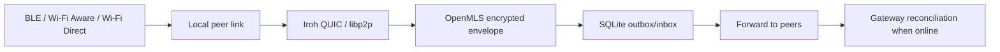

# AUTHLINK V3 — DOCUMENTAÇÃO UNIFICADA

**Status:** proposta arquitetural V3 consolidada  
**Data-base:** 2026-08-07  
**Princípio:** mobile-first, Rust-authoritative, local-first, privacy-by-default, zero-trust, purpose-bound, open-source permissive-first.

---

## 0. Decisão executiva

AuthLink deixa de ser “apenas login” e se torna o **control plane pessoal da AIIA**: identidade soberana, sessão universal, segurança do ecossistema digital, rede social, comunicação, descoberta, conhecimento e launcher dos softwares do plano.

Porém, ele **não vira dono bruto de todos os domínios**. A arquitetura mantém ownership explícito:

- **AuthLink:** identidade, credenciais, sessão, consentimento, purpose grants, trusted devices, segurança, social graph, feed, chat, conhecimento e navegação contextual.
- **PERZON:** ceremony de onboarding biométrico/prova de vida e referências biométricas conforme consentimento.
- **PEZON:** avatar/gêmeo digital; recebe referência autorizada e nunca vira autoridade de autenticação.
- **AIIA Vault:** bytes, manifests, retenção, criptografia, backup.
- **Blue Sky / health adapters:** rotina e saúde pessoal.
- **Lionz Bank:** ledger/contas/Pix/Open Finance quando regulatoriamente habilitado.
- **Lionz Chain:** provas, tokenização e settlement/proofs; não guarda PII bruta.
- **AIIA Base/Postgres:** autoridade relacional conectada, sem criar segundo usuário.

Essa separação preserva a correção já feita na documentação canônica: **AuthLink é autoridade; PERZON é ceremony; PEZON é avatar**.

---

## 1. O produto final

### 1.1 O que o usuário enxerga

AuthLink deve parecer uma combinação coerente de:

- rede profissional/social (conexões, projetos, perfil, autoridade);
- mensageria rápida (social + business);
- discovery/match por objetivos e capacidades;
- autenticador e password/passkey manager;
- central de segurança do telefone e contas;
- launcher de todos os softwares AIIA do plano;
- grafo de conhecimento livre/pago;
- microlearning de 30–90 segundos por passo;
- família/controle parental;
- saúde, rotina, treino, medicamentos e ciclos;
- finanças/Open Finance e “saúde financeira”;
- conectores oficiais de identidade/governo quando contratados/habilitados;
- Developer mode herdado do código já existente.

### 1.2 Navegação mobile canônica

**Bottom navigation fixa:**

```text
Feed · Chat · Apps · Match · Perfil
```

Não colocar dez abas na barra inferior. Segurança, Conhecimento, Família, Finanças, Business e Developer aparecem em hubs, drawers, sheets e no Perfil/AuthLink button. No desktop a mesma informação pode expandir para nav rail, sem perder função.

### 1.3 Shell

Topbar móvel:

```text
AuthLink logo | busca | notificações | avatar/trust badge
```

O trust badge abre o drawer AuthLink com sessão, purpose, dispositivo, permissões, auditoria, launcher e step-up auth.

---

## 2. Limite técnico real: “proteger tudo do celular”

AuthLink deve **proteger tudo que o sistema operacional permite que um app legítimo proteja**, e ser explícito quando a plataforma não permite acesso.

### iOS/iPadOS

É viável integrar um password/passkey/OTP manager usando AuthenticationServices Credential Provider; Family Controls/ManagedSettings suportam controle parental mediante entitlement; Wi‑Fi Aware permite comunicação direta em hardware/OS compatível; HealthKit e Photos exigem autorização granular. Um app normal não recebe poder para ler silenciosamente o sandbox privado de todos os outros apps.

### Android

Credential Manager permite third-party credential providers em Android moderno; Wi‑Fi Aware/Wi‑Fi Direct permitem links locais; DevicePolicyManager oferece controles fortes somente em papéis apropriados como device owner/profile owner; Health Connect oferece dados de saúde/FHIR com permissões. Scoped Storage impede um app comum de ler diretórios privados dos demais apps.

### Resultado de produto

“Proteção total” significa:

1. **credenciais:** provider de senhas/passkeys/OTP;
2. **fotos/documentos:** vault criptografado para itens concedidos/importados pelo usuário;
3. **contas/redes:** conectores OAuth/API + monitoramento de sessão/2FA/risco;
4. **apps:** permissões/attestation/risco onde APIs do SO permitem;
5. **rede:** DNS/VPN shield opcional, sem prometer interceptação impossível;
6. **emergência:** revogar tokens AuthLink, ocultar/fechar o que AuthLink controla, notificar confiança;
7. **família:** APIs oficiais de supervisão, não spyware.

---

## 3. Autenticação “máxima” correta

### 3.1 Não usar reconhecimento facial customizado como único login

O login forte é:

```text
Passkey/WebAuthn
+ autenticação biométrica do SO
+ device attestation/integrity
+ risk engine
+ step-up quando necessário
```

O pipeline facial PERZON serve para **identity proofing, liveness, criação de template protegido e geração autorizada do avatar PEZON**. Ele pode contribuir para assurance, mas não deve substituir sozinho passkeys/keys de hardware.

### 3.2 Ceremony recomendado

1. Boot/Welcome.
2. Criar conta ou entrar.
3. Device integrity.
4. Captura facial.
5. Liveness/PAD.
6. Documento/OCR quando necessário.
7. Correspondência + revisão humana/segunda trilha quando risco alto.
8. Consentimentos por finalidade.
9. Passkey.
10. 2FA alternativo / security key.
11. Recovery codes/contacts.
12. Vault setup.
13. Identidade soberana.
14. PEZON avatar reference opt-in.
15. Audit/proof.
16. Done → Feed.

### 3.3 Dados biométricos

- raw frame: temporário e descartado por padrão;
- template: envelope-encrypted, segregado, purpose-bound;
- liveness: resultado/score/método/versão/evidência mínima;
- avatar: uso separado por consentimento; nunca inferir permissão do login;
- blockchain: somente root/proof não reversível e não correlacionável; **nunca template, face, CPF ou hash estável de biometria bruta on-chain**.

---

## 4. Zero Trust e modelo de autorização

Toda chamada carrega:

```json
{
  "tenant_id": "...",
  "actor_id": "...",
  "session_id": "...",
  "app_id": "...",
  "workspace_id": "...",
  "purpose": "...",
  "correlation_id": "...",
  "auth_strength": "passkey+device+attestation",
  "offline": false
}
```

**Gateway:** valida token, audience, tenant, purpose, OpenFGA, rate limit, idempotency e correlation.  
**OpenFGA:** autorização relacional canônica.  
**Cedar:** cache/policy local opcional, não segunda autoridade ReBAC.  
**AuthLink:** autentica e emite contexto, não executa regra interna de outros domínios.

---

## 5. Stack V3

### 5.1 Cliente

- React + TypeScript + Design System AIIA.
- PWA web responsiva.
- Tauri 2 desktop e mobile.
- Plugins nativos Swift/Kotlin somente onde a plataforma exige.
- WGPU/WebGPU/WebGL para globo/grafo/efeitos, com reduced motion.

### 5.2 Backend autoritativo

- Rust: Axum + Tokio + SQLx.
- `/api/v1` único para UI.
- gRPC somente interno.
- PostgreSQL conectado.
- SQLite local/outbox/projections.
- typed command bus + transactional outbox.
- CloudEvents + Kafka-compatible domain backbone.
- Supabase Realtime somente read model/DB subscription.

### 5.3 Identidade V3

**Mudança proposta deliberada em relação ao documento anterior:**

- Rauthy/Apache-2.0 = perfil permissivo default;
- Kanidm/MPL-2.0 = perfil enterprise/directory opcional;
- OpenFGA = ReBAC;
- AuthLink adapter = contrato estável para todos os apps;
- compatibilidade GoTrue somente adapter, nunca segunda identidade.

### 5.4 Vault

- manifests/CAS AIIA;
- backend permissivo recomendado a validar: SeaweedFS ou S3-compatible próprio;
- criptografia por envelope;
- key hierarchy por usuário/tenant/purpose;
- OS keystore no cliente; HSM/KMS no servidor para chaves de alto valor;
- bytes grandes nunca no Postgres como autoridade principal.

### 5.5 Busca/grafo/conhecimento

- Tantivy = BM25/full-text local/servidor;
- Qdrant = vetor;
- Oxigraph = RDF/SPARQL quando necessário;
- Open Foundry = ontologia operacional/actions;
- Semantica = reasoning/provenance, não source of truth;
- DataFusion = analytics;
- Lexical = editor;
- Automerge = CRDT/offline collaboration;
- FSRS = revisão espaçada.

### 5.6 Comunicação

- OpenMLS = E2EE de grupos/mensagens;
- Matrix Rust SDK + Tuwunel = sync/federação opcional;
- LiveKit = SFU de voz/vídeo;
- Iroh/rust-libp2p = peer transport/nearby;
- SQLite outbox = store-and-forward;
- push: APNs/FCM onde necessário; local/nearby não depende de cloud quando os dispositivos conseguem link direto.

---

## 6. Comunicação offline por aproximação

Sim, é possível, mas a camada física é específica por plataforma.



Regras:

- descoberta não revela perfil completo;
- pair handshake usa ephemeral keys;
- grants offline possuem curta duração;
- peer roteador não lê conteúdo;
- nenhum salto concede permissão nova;
- reconciliação registra hop/receipt sem expor conteúdo.

---

## 7. Rede social

### 7.1 Domínios

- People/IdentityRef;
- Connection/Follow;
- Post/Comment/Reaction;
- Project;
- Community/Clan;
- Opportunity/Service;
- Reputation/Authority projections;
- Report/Block/Mute;
- FeedPreference;
- SocialConnectorGrant.

### 7.2 Feed ranking explicável

Hard filters antes de score:

```text
permission + purpose + block/mute + age/family policy + legal/region + spam/safety
```

Score inicial configurável:

```text
0.22 relevance
+0.16 relationship
+0.14 authority/provenance
+0.12 recency
+0.10 diversity
+0.10 explicit intent
+0.08 content quality
+0.08 novelty
- spam/risk penalties
```

Depois aplicar MMR/diversidade e limites de repetição. Usuário deve conseguir mudar: mais recente, pessoas, projetos, conhecimento, oportunidades.

**Proibição de produto:** biometria, saúde, ciclo hormonal, dados de crédito ou dados financeiros não entram em targeting social/ads por padrão.

### 7.3 Match

```text
candidate = graph neighborhood ∪ discovery ∪ projects/opportunities
compatibility = skills↔needs + objectives + trust + availability + shared graph + explicit intent
```

Localização é minimizada; match não recebe geolocalização precisa sem finalidade explícita.

---

## 8. Knowledge Graph + microlearning

### 8.1 Objeto central

```text
KnowledgeUnit
  id
  title
  objective
  prerequisites[]
  steps[]
  expected_seconds
  evidence_refs[]
  source_refs[]
  license
  author_ref
  authority_claims[]
  jurisdiction
  version
  price/license_offer (optional)
```

### 8.2 Grafo

Nós: conceito, passo, habilidade, ferramenta, pessoa, fonte, evidência, curso, projeto.  
Arestas: prerequisite, demonstrates, authored_by, cites, contradicts, supersedes, applies_to, derived_from.

### 8.3 “Ensinar qualquer coisa em 1 minuto”

Cada microstep dura 30–90 s:

1. objetivo;
2. pré-requisito;
3. instrução;
4. ação/check;
5. evidência/resultado esperado;
6. próximo passo.

Routing de trilha:

```text
cost(step) = expected_time + difficulty + missing_prerequisite_penalty + risk_penalty
```

Use A*/Dijkstra no DAG para chegar ao objetivo com menor custo, respeitando prerequisites e policy. Depois, FSRS agenda revisão.

### 8.4 Autoridade

Separar **popularidade** de **autoridade**. Score de autoridade deriva de:

- identidade/verificação compatível com o claim;
- credenciais/evidências;
- fontes citadas;
- outcomes verificáveis;
- revisão por pares;
- atualização/recência;
- histórico de correções;
- antifraude e conflitos de interesse.

Toda unidade paga mantém versão, licença, refund/entitlement e prova de compra; não vender “verdade”, vender acesso/licença/mentoria/conteúdo.

---

## 9. Guardian — segurança inteligente

### 9.1 Signals

- auth strength;
- device/app integrity;
- session age;
- new-device/change-of-context;
- network posture;
- credential breach result;
- impossible-travel-like metadata only when legally/purpose permitted;
- permission drift;
- repeated failures;
- unusual token use;
- phishing/domain reputation inputs;
- user-declared panic/safe-mode.

### 9.2 Decision model

Primeiro regras determinísticas/policy. ML só auxilia.

```text
risk = policy_base
     + device_integrity_penalty
     + network_penalty
     + credential_exposure_penalty
     + session_context_penalty
     + anomaly_penalty
     - strong_auth_credit
```

Thresholds:

- low → allow;
- medium → notify + optional step-up;
- high → mandatory step-up / suspend sensitive action;
- critical → block action, revoke session, require recovery/human review.

Toda decisão mostra “por quê” e permite auditoria.

---

## 10. Passwords, fotos, contas e telefone

### Credential Vault

- username/password/TOTP/passkey refs/security notes/cards identities;
- generator + zxcvbn-like strength;
- breach checks por privacy-preserving flow quando possível;
- OS AutoFill/Credential Provider;
- lock-on-background;
- clipboard timeout;
- screenshot/privacy policy por plataforma;
- export/import encrypted.

### Media Vault

- usuário escolhe/importa assets permitidos;
- content-addressed encrypted copies;
- private albums;
- on-device classification optional;
- face grouping local opt-in;
- share grants com expiry;
- delete/export/retention.

### Accounts & Networks

- OAuth/API scopes only;
- 2FA/passkey status where provider permits;
- login activity only where API legitimately exposes it;
- no screen scraping or credential stealing;
- connectors obey each platform review/quotas/terms.

### Privacy & Permissions

- inventory what **AuthLink** can observe and what OS exposes;
- explain critical permissions;
- deep-link to system settings when required;
- user-friendly “least privilege” recommendations;
- no claim of controlling another app when OS forbids it.

---

## 11. Family / controle parental

- FamilyGroup;
- GuardianRole;
- ChildProfileRef;
- AppCategoryPolicy;
- TimeWindow;
- SafetyCheck;
- RecoveryContact;
- LocationGrant (purpose + expiry);
- PurchaseApprovalRef;
- ContentPolicy.

iOS uses FamilyControls/ManagedSettings/DeviceActivity and requires the appropriate entitlement. Android consumer mode is limited; full managed-policy capability requires appropriate DPC ownership/roles.

Princípio obrigatório: **melhor interesse da criança/adolescente**, minimização, visibilidade do que é monitorado e sem transformar AuthLink em spyware familiar.

---

## 12. Saúde, treino, medicamentos, ciclos e rotina

AuthLink mostra uma **projeção controlada pelo usuário**, não vira prontuário universal invisível.

### Sources

- iOS HealthKit;
- Android Health Connect/FHIR;
- RNDS quando a implantação tiver elegibilidade/contrato/infraestrutura apropriada;
- wearables/academias por APIs consentidas;
- entrada manual.

### Dados

- treinos/plano personal;
- passos, sono, atividade, métricas permitidas;
- medicamentos e lembretes;
- consultas/agendamentos;
- menstruação e fases de ciclo quando a pessoa optar;
- marcadores hormonais masculinos/femininos somente se fonte válida e consentimento explícito;
- metas, rotina, hábitos, compras, refeições.

Não inferir diagnóstico. Recomendações médicas de alto risco exigem workflow clínico apropriado/humano.

---

## 13. Finanças, Open Finance, CPF, crédito e Gov

### 13.1 Open Finance

- AuthLink é dashboard/consent manager;
- Lionz Bank ou parceiro regulado é domínio transacional;
- usar APIs oficiais, mTLS/FAPI/consent flows do ecossistema;
- não armazenar credenciais bancárias do internet banking no servidor AuthLink;
- consentimento possui instituição, finalidade, scopes, duração e revogação.

### 13.2 CPF/Gov

- Login Único gov.br via integração oficial;
- Consulta CPF/CNPJ Serpro somente com contrato/credenciais/regras do serviço;
- Confiabilidades gov.br como claims/proofs, não substituir sua identidade interna.

### 13.3 SPC/Serasa/Bacen

- criar adapters comerciais, não scraping;
- Serasa possui portal/API empresarial; contratos e finalidade aplicável;
- SPC exige produto/contrato apropriado;
- Registrato contém dados sigilosos; tratar como fluxo autorizado, não “API pública universal”;
- BC Protege+/Open Finance entram como integrações, não como bypass regulatório.

### 13.4 Saúde financeira

- cashflow;
- subscriptions;
- budgets/goals;
- debt calendar;
- credit-health signals autorizados;
- anomaly/fraud alerts;
- net worth projection;
- explicação de origem de cada dado.

---

## 14. Lionz Bank e Lionz Chain

### 14.1 Separação obrigatória

**Bank ledger ≠ blockchain ledger.**

Lionz Bank precisa de ledger financeiro double-entry, reconciliação, settlement, HSM/custódia, segregação de funções, auditoria e integração regulada. Lionz Chain pode ancorar proofs/settlement/tokenização, mas não é o core ledger de depósitos por simples decisão técnica.

### 14.2 Chain de menor código

**Escolha recomendada para “grande LEGO”: Cosmos SDK core + CometBFT.**

Você cria a app-chain e módulos próprios; não reescreve consenso. Evite módulos com termos diferentes sem review. Alternativas:

- Reth: excelente Rust EVM execution client, mas precisa arquitetura adicional para chain soberana/consensus;
- Besu: Apache-2.0/Java, útil para redes EVM permissionadas.

### 14.3 O que AuthLink ancora

- Merkle root de audit batches;
- proof de consent grant version;
- credential-status proof não identificável;
- artifact provenance;
- contract/asset proof refs.

Nunca:

- face template;
- documento bruto;
- CPF;
- prontuário;
- chats;
- senha/passkey private material;
- localização pessoal.

---

## 15. Developer Mode herdado do `authlink-social-network.rar`

O RAR foi inventariado por sua estrutura de 1.125 entradas. A leitura de conteúdo comprimido depende de utilitário RAR ausente no ambiente, mas o índice mostra capacidades concretas que **não devem ser descartadas**:

### Settings já representados

- billing;
- data/data visualization;
- event logs;
- feature flags;
- GitHub/GitLab;
- MCP;
- modules;
- Netlify/Vercel/Supabase;
- notifications/profile;
- cloud/local model providers;
- sequencer.

### Chat/AI já representado

- API key manager;
- artifacts;
- AskOrbit;
- code/markdown;
- chat export/import;
- file preview/folder import/Git clone;
- MCP tools/tool invocations;
- model selector;
- speech recognition;
- templates/thought/progress.

### Builder já representado

- deploy GitHub/GitLab/Netlify/Vercel;
- CodeMirror/editor;
- diff/file tree/inspector/locks;
- preview/screenshots;
- Notes Workspace;
- Modules Library;
- Sequencer;
- terminal/stores/history.

### Decisão V3

Essas funções migram para **Apps → Developer**. Não ficam misturadas no feed consumidor, mas continuam integralmente acessíveis para conta/planos que possuem o modo Developer/Business.

---

## 16. Inventário V3 de UI

### Quantidades-alvo

- **108 route screens**;
- **46 sheets/dialog workflows**;
- **9 state templates universais**;
- **163 superfícies renderizáveis** (routes + sheets + state templates);
- **1.248 controles interativos alvo nas rotas**;
- **276 controles alvo nos 46 sheets** (6 por workflow como budget inicial);
- **8 controles globais do shell**, contados uma única vez;
- **1.532 definições interativas alvo** no catálogo V3.

> “Controle” inclui botão, toggle, input, tab, chip, row action, menu ou CTA; não significa 1.532 botões visíveis ao mesmo tempo. O número final deve ser gerado do TSX compilado/CSV, não mantido manualmente.

Global shell controls:

1. Search;
2. Notifications;
3. AuthLink/Trust drawer;
4. Feed;
5. Chat;
6. Apps;
7. Match;
8. Perfil.

Os detalhes por rota estão em `authlink-v3-screen-inventory.csv`.

---

## 17. Estados obrigatórios

Toda rota importante possui:

1. Loading;
2. Empty;
3. Error;
4. Offline;
5. Read-only;
6. Permission denied;
7. Stale;
8. Conflict;
9. Degraded dependency.

Operações críticas adicionam pending approval, step-up required e legal/retention hold quando aplicável.

---

## 18. APIs e eventos

### API

```text
GET    /api/v1/<domain>/<resources>
GET    /api/v1/<domain>/<resources>/:id
POST   /api/v1/commands/<command-type>
GET    /api/v1/jobs/:id
POST   /api/v1/search
GET    /api/v1/audit?object_ref=...
GET    /api/v1/capabilities/<app>
```

### AuthLink command families

```text
identity.*
credential.*
session.*
device.*
consent.*
purpose.*
security.*
vault.*
social.*
chat.*
knowledge.*
family.*
connector.*
suite.*
```

### Eventos

```text
aiia.authlink.<aggregate>.created.v1
aiia.authlink.<aggregate>.updated.v1
aiia.authlink.<operation>.completed.v1
aiia.authlink.<operation>.failed.v1
aiia.authlink.security.risk_changed.v1
aiia.authlink.session.step_up_required.v1
aiia.authlink.consent.expiring.v1
aiia.authlink.mesh.message_relayed.v1
aiia.authlink.knowledge.unit_published.v1
```

PII não entra em evento por conveniência; eventos carregam refs/claims mínimos.

---

## 19. Telemetria

- OpenTelemetry;
- correlation_id = trace_id quando apropriado;
- metrics RED/USE;
- security metrics separadas de product analytics;
- PII redigida antes de export;
- health/biometric/finance data nunca em analytics payload genérico;
- local-only telemetry option para ambientes sensíveis;
- consent/legitimate basis documented by deployment.

---

## 20. Privacy/Security engineering

### Required

- threat model por módulo;
- DPIA/RIPD para biometria/saúde/crianças/alto risco;
- key hierarchy/custody document;
- secure coding/SAST/DAST/fuzz;
- dependency/license gate;
- SBOM CycloneDX/SPDX;
- signed releases/provenance;
- reproducible build where possible;
- no secrets in logs/events/CSV;
- incident runbook;
- data export/delete/retention tooling;
- anti-impersonation/provenance for voice/avatar.

---

## 21. Roadmap de montagem

### F0 — Contracts / BOM / policy
Ownership, route IDs, command/event schemas, licenses, threat model skeleton.

### F1 — Identity foundation
IdP + OpenFGA + passkeys + session + Vault + Gateway + offline sync.

### F2 — Authenticator 20-screen flow
Onboarding/step-up/recovery/device trust/audit.

### F3 — Social core
Feed, profile, discovery, match, communities, opportunities.

### F4 — Comms
Chat social/business, OpenMLS, calls/meet, nearby mesh.

### F5 — Total Protection
Credential provider, media/file vault, accounts connectors, privacy, Guardian, backup/panic.

### F6 — Knowledge
Graph/search/editor/microlearning/authority/marketplace.

### F7 — Family/Life/Health
Platform entitlements + explicit consent + health adapters.

### F8 — Gov/Finance
Homologation adapters, Open Finance, Serpro/gov.br, credit-data commercial connectors.

### F9 — Developer mode migration
Integrations/providers/MCP/modules/sequencer/notes/workbench/deploy.

### F10 — Bank/Chain
Only after custody, HSM, threat model, external audit, regulatory design.

---

## 22. Definition of Done

Uma tela/módulo só fecha quando:

- ownership correto;
- route/command/permission/purpose definidos;
- responsive 360–1920;
- accessibility/keyboard/screen reader;
- states completos;
- no direct DB call from UI;
- telemetry without PII;
- unit/property/contract/integration/e2e;
- offline/partition/reconnect where applicable;
- security tests;
- license/SBOM gate;
- visual regression;
- documentation/changelog;
- deletion/export/retention behavior for personal data.

---

## 23. O que NÃO construir do zero

- IdP;
- ReBAC engine;
- database;
- vector index;
- full-text engine;
- event broker;
- MLS crypto;
- Matrix transport/sync if chosen;
- WebRTC SFU;
- QUIC/P2P primitive;
- CRDT;
- rich-text editor;
- spaced repetition algorithm;
- RDF store;
- blockchain consensus;
- EVM execution client;
- FHIR engine;
- map/globe engine;
- SBOM/signing scanners.

Construa adapters, policies, ownership, UX e seus domínios exclusivos.

---

## 24. O que não tem “LEGO mágico” pronto

- bank-grade liveness/PAD certification;
- full-device access beyond OS sandbox;
- universal social-network import despite provider API policies;
- Brazilian regulated banking without participant/partner/compliance;
- trust/authority algorithm specific to AuthLink;
- child/family policy that can bypass platform entitlements;
- semantic feed/match that matches your exact product values;
- safe medical decisioning without clinical governance.

Esses pontos precisam de código próprio, contratos, revisão humana, parceiro ou vendor especializado.

---

## 25. Fontes técnicas atuais para integração de plataforma

- Apple Credential Provider / AuthenticationServices: https://developer.apple.com/documentation/authenticationservices/ascredentialproviderviewcontroller
- Apple OTP AutoFill provider: https://developer.apple.com/documentation/authenticationservices/providing-one-time-passcodes-to-autofill
- Apple Family Controls: https://developer.apple.com/documentation/screentimeapidocumentation
- Apple Wi-Fi Aware: https://developer.apple.com/documentation/WiFiAware
- Apple HealthKit: https://developer.apple.com/documentation/healthkit/
- Apple PhotoKit/PhotosUI: https://developer.apple.com/documentation/photosui
- Apple App Attest/DeviceCheck: https://developer.apple.com/documentation/devicecheck
- Android Credential Provider: https://developer.android.com/identity/sign-in/credential-provider
- Android Wi-Fi Aware: https://developer.android.com/develop/connectivity/wifi/wifi-aware
- Android Wi-Fi Direct: https://developer.android.com/develop/connectivity/wifi/wifi-direct
- Android DevicePolicyManager: https://developer.android.com/reference/android/app/admin/DevicePolicyManager
- Android Health Connect: https://developer.android.com/health-and-fitness/health-connect
- Android Play Integrity: https://developer.android.com/google/play/integrity/overview
- Android scoped storage: https://developer.android.com/training/data-storage/app-specific
- gov.br Login Único: https://acesso.gov.br/roteiro-tecnico/
- Serpro Consulta CPF: https://apicenter.estaleiro.serpro.gov.br/documentacao/consulta-cpf/
- Banco Central Open Finance: https://www.bcb.gov.br/estabilidadefinanceira/openfinance
- RNDS: https://rnds-guia.saude.gov.br/
- Serasa Developer Portal: https://developer.serasaexperian.com.br/

---

## 26. Arquivos deste pacote

- `AUTHLINK_DOCUMENTACAO_UNIFICADA_V3.md` — este documento.
- `AUTHLINK_V3_README_ASSEMBLY.md` — montagem operacional.
- `authlink-v3-screen-inventory.csv` — 108 rotas/controles alvo.
- `authlink-v3-sheets-dialogs.csv` — 46 workflows contextuais.
- `authlink-v3-module-inventory.csv` — 72 módulos.
- `authlink-v3-upstream-lego.csv` — BOM OSS/repositórios/licenças/modo.
- `authlink-v3-platform-capabilities.csv` — limites reais iOS/Android/etc.
- `authlink-v3-gap-matrix.csv` — oportunidades de produto e decisões.
